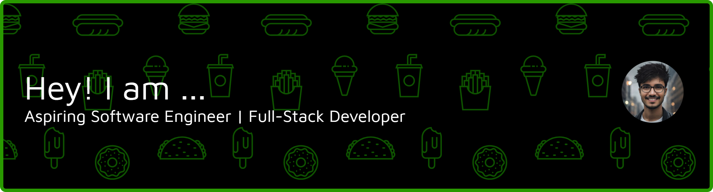

# Hi, I'm Ashraful Alam

Diploma student in Computer Science & Technology from Bangladesh, focused on building practical software solutions and preparing for higher studies abroad.

## What I Do
- Build full-stack web applications and backend systems
- Develop APIs using modern frameworks
- Work on real-world projects to improve problem-solving and engineering skills

## Current Focus
- Full-stack development (Next.js, TypeScript)
- Backend systems (FastAPI, Node.js)
- Database design (PostgreSQL, Supabase)
- Writing clean, scalable, and maintainable code

## Tech Stack
- Languages: JavaScript, TypeScript, Python  
- Frontend: Next.js, React, Tailwind CSS  
- Backend: FastAPI, Node.js, Express  
- Database: PostgreSQL, Supabase  
- Tools: Git, GitHub, Postman, Docker (learning)

## Featured Work
- Portfolio Website – Personal website showcasing projects and skills  
- Full-Stack Applications – Real-world apps with authentication and database integration  
- Backend APIs – Scalable REST APIs with proper structure and validation  
- Automation & Bots – Discord bots and utility tools  

## Goals
- Build high-quality, production-ready projects  
- Strengthen problem-solving and system design skills  
- Secure admission for international higher studies in Computer Science  

## Contact
- Email: asraful.academic@gmail.com
- GitHub: https://github.com/Asraful87

## 🌐 Socials:
  

# 💻 Tech Stack:
       
# 📊 GitHub Stats:
 
 

### ✍️ Random Dev Quote

### 🔝 Top Contributed Repo

---

  ## 💰 You can help me by Donating
   

  
<!-- Proudly created with GPRM ( https://gprm.itsvg.in ) -->
